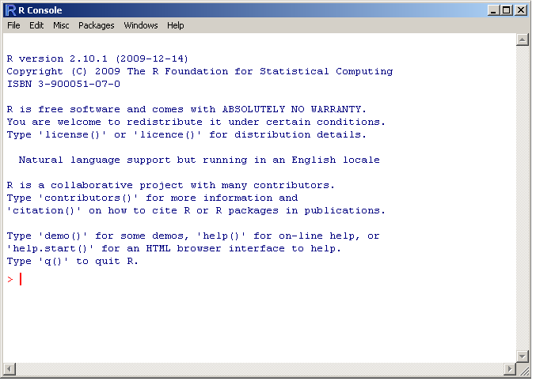

```{r knitr_init, echo=FALSE, cache=FALSE}
library(knitr)
library(rmdformats)

## Global options
options(max.print="75")

opts_knit$set(width=75)
```

<center></center>

<br>
<br>

# Instalación de R

R está disponible para los sistemas operativos Linux, Mac y Windows. Aquí describiremos los pasos necesarios para instalar la última versión de R (4.4.2) en cada uno de ellos. Si encuentra problemas en alguno de los pasos, consulte también las instrucciones en el [sitio web de CRAN](https://cran.r-project.org/).

## Instalación de R en Windows

Descargue el ejecutable de R versión 4.4.2 desde este [enlace](https://cran.r-project.org/bin/windows/base/). Haga doble clic en el archivo .exe y siga las instrucciones del instalador.

Después de terminar, al hacer clic en el ícono de R verá una ventana similar a la figura 1.

### Si hay errores en la instalación de paquetes

Si intenta instalar un paquete y no funciona, es posible que necesite instalar [Rtools](https://cran.r-project.org/bin/windows/Rtools/). Descargue la versión recomendada y siga las instrucciones del instalador.

## Instalación de R en MAC

Descargue el ejecutable de R versión 4.4.2 desde este [enlace](https://cran.r-project.org/bin/macosx/). Esta versión es compatible con distribuciones MacOS 11 o superiores. Haga doble clic en el archivo .pkg y siga las instrucciones del instalador.

Después de terminar, al hacer clic en el ícono de R verá una ventana similar a la figura 1.

### Si hay errores en la instalación de paquetes

Si intenta instalar un paquete y no funciona, es posible que necesite instalar [XQuartz](https://www.xquartz.org). Descargue la versión recomendada del archivo .pkg, haga doble clic y siga las instrucciones del instalador.

## Instalación de R en Ubuntu

Aquí consideraremos dos versiones de la distribución Ubuntu LTS (Long Term Support), pero en el [sitio web de CRAN](https://cran.r-project.org/) también encontrará instrucciones para debian, redhat y suse.

Aquí cubriremos la versión 22.04. Si no está seguro de qué distribución y versión está usando, utilice este comando para averiguarlo:

```{bash, eval=FALSE}
lsb_release -a
```

Primero, asegúrese de que su sistema esté actualizado:

```{bash, eval=FALSE}
sudo apt update
sudo apt upgrade
```

Instale las dependencias:

```{bash, eval=FALSE}
sudo apt install dirmngr gnupg apt-transport-https ca-certificates software-properties-common
```

También podría necesitar las claves:

```{bash, eval=FALSE}
wget -qO- https://cloud.r-project.org/bin/linux/ubuntu/marutter_pubkey.asc | sudo tee -a /etc/apt/trusted.gpg.d/cran_ubuntu_key.asc
```

Agregue el repositorio de R:

```{bash, eval=FALSE}
sudo add-apt-repository "deb https://cloud.r-project.org/bin/linux/ubuntu jammy-cran40/"
```

Luego solo siga estos comandos:

```{bash, eval=FALSE}
sudo apt update
sudo apt-get install r-base r-base-core r-recommended r-base-dev
```

Puede abrir R a través de la línea de comandos o haciendo clic en el ícono, y verá algo como:



# Instalación de RStudio

RStudio es una interfaz de R más amigable con funcionalidades muy prácticas. La interfaz de RStudio también está disponible para sistemas Windows, Mac y Linux. Para cualquiera de ellos, seleccione el archivo correspondiente en el [sitio web](https://www.rstudio.com/products/rstudio/download/).

En el caso de un sistema Linux, el archivo descargado tendrá una extensión `.deb` (para Ubuntu) o `.rpm` (para Fedora), y solo necesita hacer doble clic en el archivo para que el gestor de paquetes de Linux inicie la instalación.

# Posit cloud

Si no desea instalar R y RStudio en su computadora, [Posit cloud](https://rstudio.cloud/) ofrece una forma de usarlos en su navegador de internet sin instalación. Para acceder, solo necesita registrarse en el [sitio web](https://rstudio.cloud/).

El uso de esta plataforma es muy práctico, pero tiene la desventaja del tiempo limitado y la memoria RAM que se puede utilizar. No se pueden ejecutar procesos un poco más "pesados". Para el curso, el límite de RAM disponible será suficiente, pero podría no serlo para sus análisis posteriores al curso.