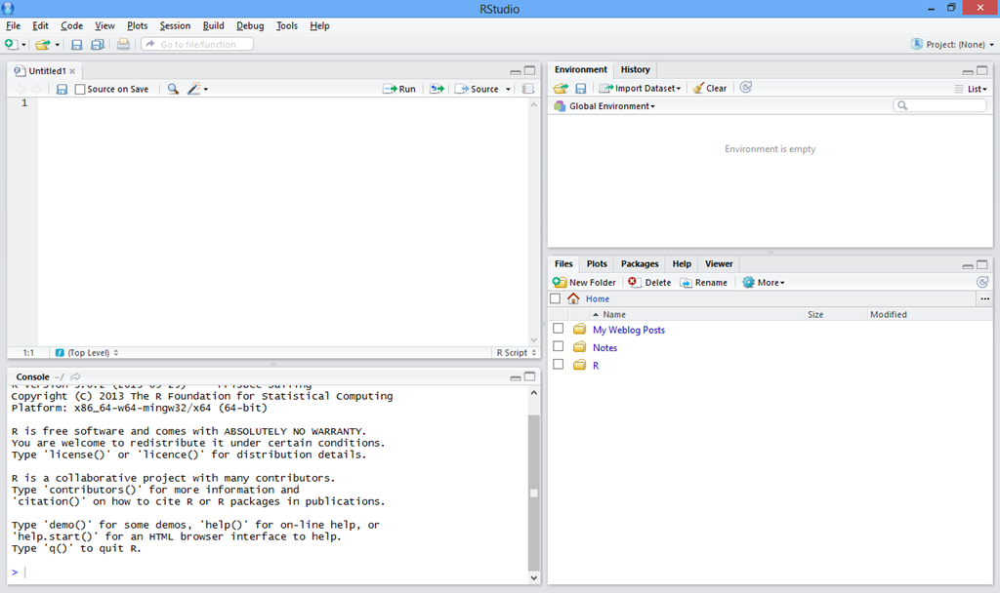

<center></center>

<br>
<br>

Este material es una actualización y traducción de los materiales elaborados por los estudiantes del Departamento de Genética de ESALQ/USP - Brasil. Acceda al contenido en portugués impartido en otros eventos [en este sitio](https://cristianetaniguti.github.io/Workshop_genetica_esalq/).

Sugerimos que, antes de comenzar la práctica descrita aquí, siga [este tutorial](https://cristianetaniguti.github.io/INTA/Installation_Tutorial-Espanol.html) para la instalación de R y RStudio.

# Familiarización con la interfaz de RStudio

Al abrir RStudio verás:



La interfaz está dividida en cuatro ventanas con funciones principales:

* Edición de código
* Entorno de trabajo e historial
* Consola
* Archivos, gráficos, paquetes y ayuda

Explora cada una de las ventanas. Hay numerosas funcionalidades para cada una de ellas, veremos algunas durante el curso.

## Un primer script

La ventana de edición de código (probablemente ubicada en la esquina superior izquierda) se utilizará para escribir tu código. Abre un nuevo script haciendo clic en el `+` en la esquina superior izquierda y seleccionando `R script`.

Vamos a comenzar con el tradicional `Hello World`. Escribe en tu script:

```{r}
cat("Hello world")
```

Ahora, selecciona la línea y presiona el botón `Run` o utiliza `Ctrl + enter`.

Al hacer esto, tu código será procesado en la ventana `Console`, donde aparecerá en azul (si tienes los colores predeterminados de R) el código escrito y, a continuación, el resultado deseado. La línea no será procesada en la consola si tiene el símbolo `#` delante. Ahora, prueba a poner `#` delante del código escrito. Nuevamente, selecciona la línea y presiona `Run`.

```{r}
# cat("Hello world")
```

El símbolo `#` se utiliza para **comentarios** en el código. Esta es una excelente práctica de organización y ayuda a recordar, posteriormente, lo que estabas pensando cuando escribiste el código. También es esencial para que otras personas puedan entenderlo. Como en el ejemplo:

```{r}
# Iniciando los trabajos en R
cat("Hello world")
```

**Importante**: siempre que quieras realizar alguna modificación, edita tu script y no directamente en la consola, ¡porque todo lo que se escribe en ella no se podrá guardar!

Para guardar tu script, puedes utilizar la pestaña `Files` ubicada (por defecto) en la esquina inferior derecha. Puedes buscar una ubicación de tu preferencia, crear una nueva carpeta con el nombre `CursoR`.

<span style="color:red"> Consejo: </span>

* Evita poner espacios y puntuación en el nombre de las carpetas y archivos, esto puede dificultar el acceso a través de la línea de comandos en R. Por ejemplo, en lugar de `Curso R`, optamos por `CursoR`.

Después, simplemente haz clic en el disquete ubicado en el encabezado de RStudio o usa `Ctrl + s` y selecciona el directorio `CursoR` creado. Los scripts en R se guardan con la extensión `.R`.

## Estableciendo el directorio de trabajo

Otra buena práctica en R es mantener el script en el mismo directorio donde están tus datos brutos (archivos de entrada en el script) y los datos procesados (gráficos, tablas, etc.). Para esto, vamos a hacer que R identifique el mismo directorio donde guardaste el script como **directorio de trabajo**. Así, entenderá que es de allí de donde se obtendrán los datos y es allí donde también irán los resultados.

Puedes hacer esto utilizando las facilidades de RStudio, simplemente localiza el directorio `CursoR` en la pestaña `Files`, haz clic en `More` y luego en "Set as Working Directory". Observa que aparecerá en la consola algo como:

```{r, eval=FALSE}
setwd("~/Documents/CursoR")
```

Es decir, puedes utilizar este mismo comando para realizar esta acción. El resultado será nuestra carpeta de trabajo. Cuando estés perdido/a o para asegurarte de que el directorio de trabajo fue cambiado, utiliza:

```{r, eval=FALSE}
getwd()
```

## Facilitando la vida con `Tab`

Ahora, imagina que tienes un directorio como `~/Documentos/maestria/semestre1/asignatura_tal/clase_tal/datos_28174/analisis_276182/resultados_161/`. No es fácil recordar todo este camino para escribir en un comando `setwd()`.

Además de la facilidad de la ventana de RStudio, también puedes utilizar la tecla `Tab` para completar el camino por ti. Prueba buscando alguna carpeta en tu computadora. ¡Solo tienes que empezar a escribir el camino y presionar `Tab`, y completará el nombre por ti! Si tienes más de un archivo con ese inicio de nombre, presiona `Tab` dos veces y te mostrará todas las opciones.

El `Tab` funciona no solo para indicar rutas, sino también para comandos y nombres de objetos. Es muy común cometer errores de escritura en el código. Utilizar el `Tab` reducirá significativamente estos errores.

El `Tab` puede ser aún más poderoso si tienes acceso a la herramienta [GitHub Copilot](https://docs.posit.co/ide/user/ide/guide/tools/copilot.html). Con ella, puedes utilizar el `Tab` para completar el código que estás escribiendo. Es una herramienta basada en inteligencia artificial que sugiere el código que estás escribiendo. Es una herramienta de pago, pero puedes utilizarla gratuitamente durante 60 días.

# Operaciones básicas

¡Vamos entonces al lenguaje!

R puede funcionar como una simple **calculadora**, que utiliza la misma sintaxis que otros programas (como Excel):

```{r, eval=FALSE}
1+1.3                 #Decimal definido con "."
2*3
2^3
4/2

sqrt(4)              #raíz cuadrada
log(100, base = 10)  #Logaritmo en base 10
log(100)             #Logaritmo en base neperiana

```

Ahora, utiliza las operaciones básicas para resolver la expresión siguiente. Recuerda utilizar paréntesis `()` para establecer prioridades en las operaciones.

$(\frac{13+2+1.5}{3})+ log_{4}96$

Resultado esperado:

```{r, echo=FALSE}
((13+2+1.5)/3) + log(96, base = 4)
```

Ten en cuenta que, si colocas los paréntesis de forma incorrecta, el código no resultará en ningún mensaje de error, pues este es un error que llamamos **error lógico** o **error silencioso**, es decir, el código se ejecuta pero no hace lo que quieres que haga. Este es el tipo de error más peligroso y difícil de corregir. Ve un ejemplo:

```{r}
13+2+1.5/3 + log(96, base = 4)
```

Los errores que producen un mensaje, ya sea una advertencia (**warning**) o un error (**error**) se llaman **errores de sintaxis**. En estos casos, R devolverá un mensaje para ayudarte a corregirlos. Los **warnings** no comprometen el funcionamiento del código, pero llaman la atención sobre algún punto; los **errors**, por otro lado, necesitan ser corregidos necesariamente para que el código funcione.

Ejemplo de error:

```{r, eval=FALSE}
((13+2+1,5)/3) + log(96, base = 4)
```

También puedes olvidar cerrar algún paréntesis, comillas, corchetes o llaves, en estos casos, R esperará el comando para cerrar el bloque de código señalizando con un `+`:

```{r, eval=FALSE}
((13+2+1.5)/3 + log(96, base = 4)
```

Si esto sucede, ve a la consola y presiona ESC, y el bloque se finalizará para que puedas corregirlo.

Los comandos `log` y `sqrt` son dos de muchas otras funciones básicas que R posee. Las funciones son conjuntos de instrucciones organizadas para realizar una tarea. Para todas ellas, R tiene una descripción para ayudar en su uso. Para acceder a esta ayuda usa:

```{r, eval=FALSE}
?log
```

Y se abrirá la descripción de la función en la ventana `Help` de RStudio.

Si la descripción del propio R no es suficiente para que entiendas cómo funciona la función, busca en Google (preferiblemente en inglés). Existen diversos sitios y foros con información didáctica sobre las funciones de R.

## Operaciones con vectores

Los vectores son las estructuras más simples trabajadas en R. Construimos un vector con una secuencia numérica usando:

```{r}
c(1,3,2,5,2)
```

**MUCHA ATENCIÓN**: La *c* es la función de R (*Combine Values into a Vector or List*) con la cual construimos un vector!

Utilizamos el símbolo `:` para crear secuencias de números enteros, como:

```{r}
1:10
```

Podemos utilizar otras funciones para generar secuencias, como:

```{r}
seq(from=0, to=100, by=5)
# o
seq(0,100,5) # Si ya conoces el orden de los argumentos de la función
```

* Crea una secuencia utilizando la función `seq` que varíe de 4 a 30, con intervalos de 3 en 3.

```{r, echo=FALSE}
seq(from=4, to=30, by=3)
```

La función `rep` genera secuencias con números repetidos:

```{r}
rep(3:5, 2)
```

Podemos realizar operaciones utilizando estos vectores:

```{r,eval=FALSE}
c(1,4,3,2)*2
c(4,2,1,5)+c(5,2,6,1)
c(4,2,1,5)*c(5,2,6,1)
```

Observa que ya está resultando cansado escribir los mismos números repetidamente, vamos a resolver esto creando **objetos** para almacenar nuestros vectores y mucho más.

# Creando objetos

El almacenamiento de información en objetos y su posible manipulación hace de R un lenguaje *orientado a objetos*. Para crear un objeto basta con asignar valores a las variables, como sigue:

```{r, results='hide'}
x = c(30.1,30.4,40,30.2,30.6,40.1)
# o
x <- c(30.1,30.4,40,30.2,30.6,40.1)

y = c(0.26,0.3,0.36,0.24,0.27,0.35)
```

Los más antiguos suelen usar el signo `<-`, pero tiene la misma función que `=`. Hay quienes prefieren usar `<-` para asignación en objetos y `=` solo para definir los argumentos dentro de funciones. Organízate de la forma que prefieras.

Para acceder a los valores dentro del objeto simplemente:

```{r}
x
```

El lenguaje es sensible a mayúsculas y minúsculas. Por lo tanto, `x` es diferente de `X`:

```{r, eval=FALSE}
X
```

El objeto `X` no fue creado.

El nombre de los objetos es una elección personal, la sugerencia es tratar de mantener un patrón para mejor organización. Aquí hay algunos consejos:

* Usar nombres descriptivos
* Evitar empezar con números
* No usar espacios (usar _ o camelCase)
* No usar caracteres especiales
* Mantener consistencia en el patrón elegido
* Evitar nombres muy largos
* No usar acentos o caracteres no ASCII

Algunos nombres no pueden usarse por establecer roles fijos en R, son:

* TRUE - Verdadero, valor lógico
* FALSE - Falso, valor lógico
* if, else, for, while, break, next - Palabras reservadas para estructuras condicionales y de repetición
* for, while, repeat - Palabras reservadas para estructuras de repetición
* function - Palabra reservada para definición de funciones
* in, NA, NaN, NULL - Palabras reservadas para valores especiales
* NA_integer__, NA_real_, NA_character_, NA_complex_ - Valores especiales para representar datos ausentes

Podemos entonces realizar operaciones con el objeto creado:

```{r}
x+2
x*2
```

Para realizar la operación, R alinea los dos vectores y realiza la operación elemento a elemento. Observa:

```{r}
x + y
x*y
```

Si los vectores tienen tamaños diferentes, repetirá el menor para realizar la operación elemento a elemento con todos los del mayor.

```{r, results='hide'}
x*2
x*c(1,2)
```

Si el vector menor no es múltiplo del mayor, obtendremos una advertencia:

```{r}
x*c(1,2,3,4)
```

Nota que el **warning** no compromete el funcionamiento del código, solo da una pista de que algo puede no estar como quisieras.

También podemos almacenar la operación en otro objeto:

```{r, results='hide'}
z <- (x+y)/2
z
```

También podemos aplicar algunas funciones, por ejemplo:

```{r}
sum(z)  # suma de los valores de z
mean(z) # media
var(z)  # varianza
```

## Indexación

Accedemos solo al 3er valor del vector creado con `[]`:

```{r, results='hide'}
z[3]
```

También podemos acceder a los números de la posición 2 a 4 con:

```{r}
z[2:4]
```

Para obtener información del vector creado utiliza:

```{r}
str(z)
```

La función `str` nos dice sobre la estructura del vector, que se trata de un vector **numérico** con 6 elementos.

Los vectores también pueden recibir otras categorías como **caracteres**:

```{r}
clone <- c("GRA02", "URO01", "URO03", "GRA02", "GRA01", "URO01")
```

Otra clase son los **factores**, estos pueden ser un poco complejos de manejar.

En general, los factores son valores categorizados por `levels`, como ejemplo, si transformamos nuestro vector de caracteres `clone` en factor, se asignarán niveles para cada una de las palabras:

```{r}
clone_factor <- as.factor(clone)
str(clone_factor)
levels(clone_factor)
```

De esta forma, tendremos solo 4 niveles para un vector con 6 elementos, ya que las palabras "GRA02" y "URO01" se repiten. Podemos obtener el número de elementos del vector o su longitud con:

```{r}
length(clone_factor)
```

También hay vectores **lógicos**, que reciben valores de verdadero o falso:

```{r}
logico <- x > 40
logico   # ¿Los elementos son mayores que 40?
```

Con él podemos, por ejemplo, identificar cuáles son las posiciones de los elementos mayores que 40:

```{r}
which(logico)  # Obteniendo las posiciones de los elementos TRUE

x[which(logico)] # Obteniendo los números mayores que 40 del vector x por posición
# o
x[which(x > 40)]
```

También podemos localizar elementos específicos con:

```{r}
clone %in% c("URO03", "GRA02")
```

También pueden ser útiles las funciones `any` y `all`. Investiga sobre ellas.

Encuentra más sobre otros operadores lógicos, como el `>` utilizado, en este [enlace](http://www.statmethods.net/management/operators.html).

[Continúa con la siguiente parte del texto para los Warnings y consejos...]

**Warning1**

Haz una secuencia numérica, conteniendo 10 valores enteros, y guárdala en un objeto llamado "a".

```{r}
(a <- 1:10)
```

Crea otra secuencia, utilizando números decimales y cualquier operación matemática, de tal forma que sus valores sean idénticos al objeto "a".

```{r}
b <- seq(from = 0.1, to = 1, 0.1)
(b <- b*10)
```

Los dos vectores parecen iguales, ¿no?

Entonces, utilizando un operador lógico, vamos a verificar si el objeto "b" es igual al objeto "a".

```{r}
a==b
```

Algunos valores no son iguales. ¿Cómo es esto posible?

```{r}
a==round(b)
```

**Warning2**

No es posible mezclar diferentes clases dentro de un mismo vector. Al intentar hacer esto, observa que R intentará igualar a una única clase:

```{r}
errado <- c(TRUE, "vish", 1)
errado
```

En este caso, todos los elementos fueron transformados en caracteres.

**Algunos Consejos**:

* Ten cuidado con la prioridad de las operaciones, en caso de duda, siempre añade paréntesis según tu interés de prioridad.
* Recuerda que, si olvidas cerrar algún `(` o `[` o `"`, la consola de R esperará que lo cierres indicando un `+`. Nada será procesado hasta que escribas directamente en la consola un `)` o presiones ESC.
* Ten cuidado de no sobreponer objetos ya creados creando otros con el mismo nombre. Usa, por ejemplo: altura1, altura2.
* Mantén en tu script .R solo los comandos que funcionaron y, preferentemente, añade comentarios. Puedes, por ejemplo, comentar dificultades encontradas, para que no cometas los mismos errores más tarde.

> Si estás adelantado/a respecto a tus compañeros, ya puedes hacer los ejercicios de la [**Sesión 1**](exercises-Espanhol.html#sesion1), si no, hazlos en otro momento y envíanos dudas.

## Matrices

Las matrices son otra clase de objetos muy utilizados en R, con ellas podemos realizar operaciones de mayor escala de forma automatizada.

Por ser usadas en operaciones, normalmente almacenamos en ellas elementos numéricos. Para crear una matriz, determinamos una secuencia de números e indicamos el número de filas y columnas de la matriz:

```{r}
X <- matrix(1:12, nrow = 6, ncol = 2)
X
```

También podemos utilizar secuencias ya almacenadas en vectores para generar una matriz, siempre que sean numéricos:

```{r}
W <- matrix(c(x,y), nrow = 6, ncol =2)
W
```

Con ellas podemos realizar operaciones matriciales:

```{r}
X*2
X*X        
X%*%t(X)          # Multiplicación matricial
```

Utilizar estas operaciones exige conocimiento de álgebra de matrices, si quieres profundizar al respecto, el libro *Linear Models in Statistics, Rencher (2008)* tiene una buena revisión al respecto. También puedes explorar la sintaxis de R para estas operaciones en este [enlace](http://www.statmethods.net/advstats/matrix.html).

Accedemos a los números internos de la matriz dando las coordenadas [fila,columna], como en el ejemplo:

```{r}
W[4,2] # Número posicionado en la fila 4 y columna 2
```

A veces puede ser informativo dar nombres a las columnas y a las filas de la matriz, lo hacemos con:

```{r}
colnames(W) <- c("altura", "diametro")
rownames(W) <- clone
W
```

Estas funciones `colnames` y `rownames` también funcionan en los data.frames.

## Data.frames

A diferencia de las matrices, no realizamos operaciones con los data.frames, pero permiten la unión de vectores con clases diferentes. Los *data frames* son similares a tablas generadas en otros programas, como Excel.

Los *data frames* son combinaciones de vectores de la misma longitud. Todos los que creamos hasta ahora tienen tamaño 6, verifica.

Podemos así combinarlos en columnas de un único data.frame:

```{r}
campo1 <- data.frame("clone" = clone,     # Antes del signo "="  
                     "altura" = x,        # establecemos los nombres  
                     "diametro" = y,      # de las columnas
                     "edad" = rep(3:5, 2),
                     "corte"= logico) 
campo1
```

Podemos acceder a cada una de las columnas con:

```{r}
campo1$edad
```

O también con:

```{r}
campo1[,4] 
```

Aquí, el número dentro de los corchetes se refiere a la columna, por ser el segundo elemento (separado por coma). El primer elemento se refiere a la fila. Como dejamos el primer elemento vacío, nos estaremos refiriendo a todas las filas para esa columna.

De esta forma, si queremos obtener un contenido específico podemos dar las coordenadas con [fila,columna]:

```{r}
campo1[1,2] 
```

* Obtén el diámetro del clon "URO03".

```{r, echo=FALSE}
campo1[3,3] 
```

Aunque se trate de un *data frame*, podemos realizar operaciones con los vectores numéricos que lo componen.

* Con el diámetro y la altura de los árboles, calcula el volumen conforme a la fórmula siguiente y almacénalo en un objeto `volumen`:

$3.14*(diametro/2)^2*altura$

```{r, echo=FALSE}
volumen <- 3.14*((campo1$diametro/2)^2)*campo1$altura
volumen
```

Ahora, vamos a añadir el vector calculado con el volumen a nuestro *data frame*. Para esto usa la función `cbind`.

```{r}
campo1 <- cbind(campo1, volumen)
campo1
str(campo1)
```

**Algunos consejos**:

* Recuerda que, para construir matrices y *data frames*, las columnas deben presentar el mismo número de elementos.

* En caso de que no sepas el operador o la función que debe ser utilizada, busca en Google o pregunta al chatgpt o cualquier otra herramienta. Por ejemplo, si tienes dudas sobre cómo calcular la desviación estándar, busca por "desviación estándar R" o, mejor aún, "standard deviation R". La comunidad de R es bastante activa y gran parte de tus preguntas sobre él ya fueron respondidas en algún lugar de la web.

* No olvides que todo lo que hagas en R necesita ser explícitamente indicado, como una multiplicación 4ac con `4*a*c`. Para generar un vector 1,3,2,6 es necesario: `c(1,3,2,6)`.

## Listas

Las listas consisten en una colección de objetos, no necesariamente de la misma clase. En ellas podemos almacenar todos los otros objetos ya vistos y recuperarlos mediante la indexación con `[[`. Como ejemplo, vamos a utilizar algunos objetos que ya fueron generados.

```{r}
mi_lista <- list(campo1 = campo1, media_alt = tapply(campo1$altura, campo1$edad, mean), matrix_ex = W)
str(mi_lista)
```

Quiero acceder al data.frame `campo1`

```{r}
mi_lista[[1]] 
# o
mi_lista$campo1
```

Para acceder a una columna específica en el data.frame `campo1`, que está dentro de mi_lista:  

```{r}
mi_lista[[1]][[3]]
# o
mi_lista[[1]]$diametro
# o
mi_lista$campo1$diametro
```

Las listas son muy útiles, por ejemplo, cuando vamos a utilizar/generar diversos objetos dentro de un bucle.

## Arrays

Este es un tipo de objeto que probablemente no utilizarás ahora al principio, pero es bueno saber de su existencia. Se utilizan para almacenar datos con más de dos dimensiones. Por ejemplo, si creamos un array:

```{r}
(mi_array <- array(1:24, dim = c(2,3,4)))
```

Tendremos cuatro matrices con dos filas y tres columnas y los números del 1 al 24 estarán distribuidos en ellas por columnas.

> Si estás adelantado/a respecto a tus compañeros, ya puedes hacer los ejercicios de la [**Sesión 2**](exercises-Portugues.html#sesion2), si no, hazlos en otro momento y envíanos dudas por el foro.

# Importando y exportando datos

Los archivos RData son exclusivos de R, haciendo clic dos veces en el archivo o utilizando:

```{r}
load("data/dia_1.RData")
```

Recuperarás todos los objetos generados hasta ahora en el tutorial. Para generar ese archivo RData, ejecuté todos los códigos de aquí arriba y usé:

```{r, eval=FALSE}
save.image(file = "dia_1.RData")
```

Este comando guarda todo lo que tienes en tu Entorno Global (todos los objetos que aparecen allí en la esquina superior derecha). También puedes guardar solo un objeto con:

```{r, eval=FALSE}
save(campo1, file = "campo1.RData")
```

Si lo eliminamos de nuestro Entorno Global con:

```{r, eval=FALSE}
rm(campo1)  # Asegúrate de haber guardado el archivo RData antes de eliminarlo
```

Podemos fácilmente obtenerlo de nuevo con:

```{r, eval=FALSE}
load("campo1.RData")
```

El formato RData es exclusivo para R, es interesante usarlo para hacer lo que estamos haciendo, paramos el análisis un día, vamos a continuar en otro y no queremos tener que ejecutar todo de nuevo. Pero muchas veces necesitamos exportar nuestros datos a otros programas, que exigen otros formatos, como por ejemplo `.txt` o `.csv`. Para eso utilizamos:

```{r, eval=FALSE}
write.table(campo1, file = "campo1.txt", sep = ";", dec = ".", row.names = FALSE)
write.csv(campo1, file = "campo1.csv", row.names = TRUE)
```

Nota: Puedes adquirir paquetes para exportar e importar datos con otros formatos, como por ejemplo el paquete `xlsx` exporta e importa datos con formato de Excel. El paquete `vroom` puede ser utilizado para compactar grandes tablas. Para instalar paquetes, utiliza la función `install.packages("nombre_del_paquete")` y para cargar el paquete utiliza `library(nombre_del_paquete)`. Veremos más sobre paquetes en la sesión "Aplicación de Paquetes" de este curso.

Al exportar, hay diversas opciones para el formato del archivo, es importante considerarlas si el archivo será usado en otro software posteriormente.

Abre los archivos generados en tu bloc de notas para visualizar su formato. Observa que el archivo `.txt` fue guardado con el separador `;` y el separador decimal `.`. Ya el archivo `.csv` fue guardado con el separador de coma `,` y el separador decimal `.`.

Estos archivos pueden ser leídos nuevamente por R, utilizando las funciones y sus especificaciones:

```{r, eval=FALSE}
campo1_txt <- read.table(file = "campo1.txt", sep=";", dec=".", header = TRUE)
campo1_csv <- read.csv(file = "campo1.csv")
head(campo1_txt)
head(campo1_csv)
```

[Continúa con la traducción de la parte sobre los datos de los participantes...]

Ahora que aprendimos a importar datos, vamos a trabajar con el conjunto generado a partir de los participantes de la asignatura Biometría de Marcadores (ESALQ/USP - Brasil) - Clase de 2021.

<span style="color:red">
La planilla con los datos está disponible en el enlace de abajo, agrégala a tu directorio de trabajo o indica la ruta de la carpeta al importarla a R, como sigue. </span>

* [dados.RData](https://cristianetaniguti.github.io/Workshop_genetica_esalq/CursoRBiometria_2021/dados_alunos2021.RData)
* [dados.csv](https://cristianetaniguti.github.io/Workshop_genetica_esalq/CursoRBiometria_2021/dados_alunos2021.csv)

También podemos importar los datos directamente de GitHub, apuntando a la dirección web.

```{r, eval=FALSE}
dados <- read.csv("https://github.com/Cristianetaniguti/Workshop_genetica_esalq/raw/master/SIFSC11/dados_alunos2021.csv")
```

Aquí usaremos también el argumento `na.strings` que indicará cómo fueron nombrados los datos perdidos.

```{r, eval=FALSE}
dados <- read.csv(file = "dados_alunos2021.csv", na.strings="-", header = T, dec = ",")
head(dados)
```

```{r}
load("data/dados_alunos2021.RData")
```

Vamos a explorar la estructura de los datos recolectados:

```{r}
str(dados)
# también
dim(dados)
```

Observa que en los nombres de las columnas aún están las preguntas completas hechas en el formulario, vamos a cambiarlas a nombres más fáciles de trabajar:

```{r}
colnames(dados)

colnames(dados) = c("Ocupacion", "Graduacion", "Conocimientos_Genetica", "Conocimientos_Estadistica", "Conocimiento_Gen_Est", 
                   "Latitud", "Longitud")
colnames(dados)
str(dados)
```

# Manipulando los datos

Ahora usaremos los datos que tenemos para aprender diferentes comandos y funciones del Ambiente R.

Primero, vamos a verificar cuántos alumnos respondieron las preguntas del formulario de la asignatura, contando el número de filas, para esto usa la función `nrow`.

```{r}
nrow(dados)
```

Vamos entonces a verificar si tenemos en nuestro grupo personas que comparten la misma graduación y ocupación.

Podemos verificar esto fácilmente con la función `table`, que indica la frecuencia de cada observación:

```{r, eval=FALSE}
table(dados$Graduacion)
table(dados$Ocupacion)
```

# Estructuras condicionales

## if y else

Para nuestra próxima actividad con los datos, vamos primero a entender cómo funcionan las estructuras `if` y `else`.

En las funciones condicionales `if` y `else`, establecemos una condición para if, si es verdadera la actividad será realizada, en caso contrario (else) otra tarea será realizada. Como en el ejemplo:

```{r}
if(2 > 3){
  cat("dos es mayor que tres")
} else {
  cat("dos no es mayor que tres")
}
```

* Descubre el Nivel de Conocimientos en Genética (3ª columna) de la segunda persona que respondió (línea 2). Envía un mensaje motivacional si tiene conocimientos básicos, otro si la persona ya tiene conocimiento Intermedio o Avanzado (resto de respuestas). (pista: el signo `==` se refiere a "exactamente igual a")

```{r}
if(dados[2,3] =="Básico"){
  cat("¡Ánimo, Mendel cree en ti!")
} else {
  cat("Mendel agradece tu preferencia")
}
```

Podemos especificar más de una condición repitiendo la estructura `if` `else`:
Ahora vamos a estudiar la ocupación de las personas que respondieron al cuestionario.

```{r}
if(dados[2,1] == "Maestría"){
  cat("¡Ánimo, el día de pago está llegando!")
} else if (dados[2,1] == "Doctorado"){
  cat("Al igual que tus amigos de la maestría, ¡confía en que el viernes cae la beca!")
} else {
  cat("Este ya tiene trabajo fijo, ¡qué bien!")
}
```

Pero observa que solo es posible utilizar estas estructuras para un elemento individual del vector o en todo él, si queremos recorrer los elementos individualmente necesitamos recurrir a otro recurso.

# Estructuras de repetición

## For

Este recurso puede ser la función `for`, una función muy utilizada y poderosa. Constituye una estructura de bucle, pues aplicará la misma actividad repetidamente hasta alcanzar una determinada condición. Ve ejemplos:

```{r}
for(i in 1:10){
  print(i)
}

test <- vector()
for(i in 1:10){
  test[i] <- i+4 
}
test
```

En los casos anteriores, `i` funciona como un índice que variará de 1 hasta 10 la operación determinada entre llaves.

Con esta estructura, podemos repetir la operación realizada con las estructuras `if` y `else` para todo el vector:

```{r, eval=F}
for(i in 1:nrow(dados)){
  if(dados[i,1] == "Maestría"){
    print("¡Ánimo, el día de pago está llegando!")
  } else if (dados[i,1] == "Doctorado"){
    print("Al igual que tus amigos de la maestría, ¡confía en que el viernes cae la beca!")
  } else {
    print("Este ya tiene trabajo fijo, ¡qué bien!")
  }
}
```

**Consejo: Indentación**

Observa la diferencia:

```{r, eval=FALSE}
# Sin indentación
for(i in 1:nrow(dados)){
if(dados[i,1] == "Maestría"){
print("¡Ánimo, el día de pago está llegando!")
} else if (dados[i,1] == "Doctorado"){
print("Al igual que tus amigos de la maestría, ¡confía en que el viernes cae la beca!")
} else {
print("Este ya tiene trabajo fijo, ¡qué bien!")
}
}

# Con indentación correcta
for(i in 1:nrow(dados)){
  if(dados[i,1] == "Maestría"){
    print("¡Ánimo, el día de pago está llegando!")
  } else if (dados[i,1] == "Doctorado"){
    print("Al igual que tus amigos de la maestría, ¡confía en que el viernes cae la beca!")
  } else {
    print("Este ya tiene trabajo fijo, ¡qué bien!")
  }
}
```

El editor de código de RStudio tiene una facilidad para indentar códigos en R, selecciona el área que deseas indentar y presiona `Ctrl+i`.

Ahora vamos a trabajar con la columna 2, que tiene la información de la graduación de los participantes. Observa que la función `table` retorna diferentes categorías que podrían resumirse en una sola, como "Ingeniería agronómica" y "Agronomía". Vamos a utilizar un bucle para descubrir cuáles respondieron áreas relacionadas con "Agro". Después, cuáles de esas respuestas no fueron "Agronomía" y pedir que este participante modifique la respuesta escribiendo solo "Agronomía".

Pista 1: Para identificar el patrón "Agro" podemos utilizar la función `grepl`.
Pista 2: Podemos utilizar if dentro de if

```{r}
# Ejemplo del uso de la función grepl
dados[,2]
grepl("Agro", dados[,2]) # Qué líneas contienen los caracteres "Agro"
dados[grepl("Agro", dados[,2]),2]

for(i in 1:nrow(dados)){
  if(grepl("Agro", dados[i,2])){
    if(dados[i,2] != "Agronomía"){
     print("Por favor, sustituya su respuesta por Agronomía.") 
    }
  } 
}
```

Para que sea posible imprimir contenido de objetos durante el bucle, usamos la función `cat`, ella no separa cada respuesta en una línea, necesitamos poner el `\n` indicando el salto de línea.

Ahora vamos a homogeneizar estas informaciones. Podemos almacenar en una variable la posición de las líneas identificadas, entonces corregiremos manualmente solo esas:

```{r}
homog <- vector()
for(i in 1:nrow(dados)){
  if(grepl("Agro", dados[i,2])){
    if(dados[i,2] != "Agronomía"){
     print("Por favor, sustituya su respuesta por Agronomía.") 
     homog <- c(homog, i)
    }
  } 
}

homog
```

> ¿Cómo harías para corregir esos elementos erróneos? ¡Inténtalo!

['dados[homog, 2] <- "Agronomía"']{.spoiler}

## While

En este tipo de estructura de repetición, la tarea se realizará hasta que se alcance determinada condición.

```{r}
x <- 1

while(x < 5){
  x <- x + 1
  cat(x)
}
```

Es muy importante que en esta estructura se alcance la condición, en caso contrario el bucle funcionará infinitamente y tendrás que interrumpirlo por medios externos. Un ejemplo de estos "medios externos" en RStudio es hacer clic en el símbolo en rojo en la esquina superior derecha de la ventana de la consola. También puedes presionar Ctrl+C en la consola.

No es muy difícil que esto suceda, basta un pequeño error como:

```{r, eval=FALSE}
x <- 1

while(x < 5){
  x + 1
  cat(x)
}
```

Aquí podemos utilizar los comandos `break` y `next` para atender otras condiciones, como:

```{r}
x <- 1

while(x < 5){
  x <- x + 1
  if(x==4) break
  cat(x)
}

x <- 1

while(x < 5){
  x <- x + 1
  if(x==4) next
  cat(x)
}

```

## Repeat

Esta estructura también exige una condición de parada, pero esta condición se coloca necesariamente dentro del bloque de código con el uso de `break`. Entonces repite el bloque de código hasta que la condición lo interrumpa.

```{r}
x <- 1
repeat{
  x <- x+1
  cat(x)
  if(x==4) break
}
```

## Bucles dentro de bucles

También es posible utilizar estructuras de repetición dentro de estructuras de repetición. Por ejemplo, si queremos trabajar tanto en las columnas como en las filas de una matriz.

```{r}
# Creando una matriz vacía
ex_mat <- matrix(nrow=10, ncol=10)

# cada número dentro de la matriz será el producto del índice de la columna por el índice de la fila
for(i in 1:dim(ex_mat)[1]) {
  for(j in 1:dim(ex_mat)[2]) {
    ex_mat[i,j] = i*j
  }
}
```

Otro ejemplo de uso:

```{r}
var1 <- c("fertilizante1", "fertilizante2")
var2 <- c("ESS", "URO", "GRA")

w <- 1
for(i in var1){
  for(j in var2){
    nombre_archivo <- paste0(i,"_planta_",j,".txt")
    archivo <- data.frame("bloque" = "fake_data", "tratamiento" ="fake_data")
    write.table(archivo, file = nombre_archivo)
    w <- w + 1
  }
}

# Verifica tu directorio de trabajo, los archivos deben haber sido generados
```

> Si estás adelantado/a respecto a tus compañeros, ya puedes hacer los ejercicios de la [**Sesión 3**](ejercicios.html#sesion3), si no, hazlos en otro momento y envíanos dudas por el foro.

**Algunos consejos**:

* Ten cuidado al ejecutar el mismo comando más de una vez, algunas variables pueden no ser como eran antes. Para que el comando funcione de la misma forma es necesario que los objetos de entrada estén de la forma que esperas.
* Recuerda que `=` es para definir objetos y `==` es el signo de igualdad.
* En las estructuras condicionales y de repetición, recuerda que es necesario mantener la sintaxis esperada: If(){} y for(i in 1:10){}. En el *for*, podemos cambiar la letra que será el índice, pero siempre es necesario proporcionar una secuencia de enteros o caracteres.
* Usar indentación ayuda a visualizar el principio y fin de cada estructura de código y facilita el abrir y cerrar llaves. Indentación son esos espacios que usamos antes de la línea, como:

```{r}
# Creando una matriz vacía
ex_mat <- matrix(nrow=10, ncol=10)

# cada número dentro de la matriz será el producto del índice de la columna por el índice de la fila
for(i in 1:dim(ex_mat)[1]) {   # Primer nivel, no tiene espacio
  for(j in 1:dim(ex_mat)[2]) { # Segundo nivel tiene un espacio (tab)
    ex_mat[i,j] = i*j          # Tercer nivel tiene dos espacios
  }                            # Cerré el segundo nivel
}                              # Cerré el primer nivel
```

# Vectorización

Aunque los bucles son intuitivos y más fáciles de entender, son más lentos y menos eficientes que la vectorización. La vectorización es una técnica que permite aplicar operaciones en todos los elementos de un vector o matriz de una sola vez, sin la necesidad de iterar sobre cada elemento individualmente.

Aquí está un simple ejemplo de un código no vectorizado (utilizando bucle) y su versión vectorizada:

```{r}
# No vectorizado (usando bucle)
numeros <- 1:5
resultado_bucle <- numeric(length(numeros))
for(i in 1:length(numeros)) {
    resultado_bucle[i] <- numeros[i] * 2
}

# Enfoque vectorizado
numeros <- 1:5
resultado_vectorizado <- numeros * 2

resultado_bucle == resultado_vectorizado
```

> Esta transformación de código puede volverse más compleja dependiendo del escenario. Por ejemplo, piensa cómo sería una versión vectorizada del bucle anterior:

```{r}
# No vectorizado (usando bucle)
ex_mat <- matrix(nrow=10, ncol=10)

for(i in 1:dim(ex_mat)[1]) {   
  for(j in 1:dim(ex_mat)[2]) { 
    ex_mat[i,j] = i*j          
  }                            
}

# ¿Vectorizado?
```

Aquí es un buen momento para que practiques el uso de una herramienta de IA para ayudarte a transformar el código en una versión vectorizada. Puedes utilizar chatgpt o copilot, por ejemplo. Compara el resultado del código proporcionado con el que generaste con el bucle para verificar si la herramienta está realmente haciendo lo que deseas. Esta transformación vale la pena si el código en bucle está muy lento o si tienes que ejecutar el mismo código muchas veces.

['ex_mat <- outer(1:10, 1:10, "*")']{.spoiler}
