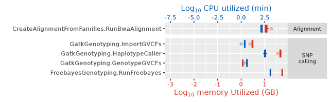
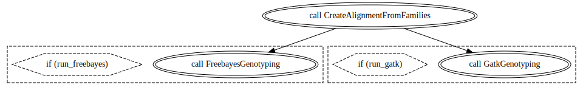
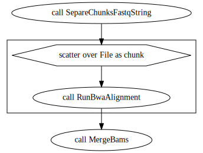
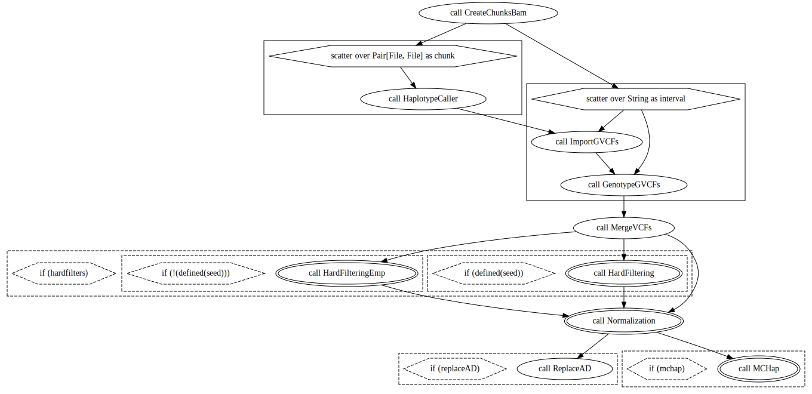
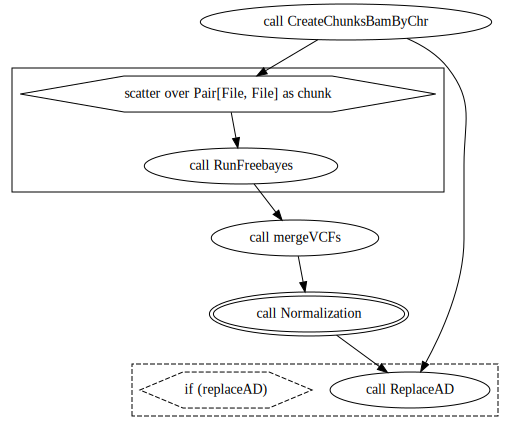

```{r setup, include=FALSE}
knitr::opts_chunk$set(collapse = TRUE,
                      comment = "#>",
                      fig.width = 16,
                      fig.height = 16,
                      fig.align = "center",
                      dev = "png",
                      cache = TRUE)
```


# What you will need to run this tutorial

* Linux system (or WSL)
* At least 4G RAM
* At least 7G HD
* Docker or singularity
* Internet connection

**warning**: Before start, it is important to highlight that all software here presented have several parameters that can be adjusted for each given scenario. Here, we will use the default settings, but for the best usage of each one of them, it is important to explore their specificity. So... use it carefully with other data sets!

# Getting all required software

To save time during the tutorial, pull now all the required images:

* Docker

```{bash, eval=FALSE}
docker pull biocontainers/fastqc:v0.11.9_cv7
docker pull ewels/multiqc:latest
docker pull kfdrc/bwa-picard:latest-dev
docker pull cristaniguti/r-samtools:latest
docker pull kfdrc/cutadapt:latest
docker pull taniguti/gatk-picard:latest
docker pull us.gcr.io/broad-gotc-prod/genomes-in-the-cloud:2.5.7-2021-06-09_16-47-48Z
docker pull cristaniguti/reads2map:0.0.3
```

* Singularity

```{bash, eval=FALSE}
mkdir .singularity
cd .singularity

export SINGULARITY_CACHEDIR=$SCRATCH/.singularity

singularity pull biocontainers_fastqc_v0.11.9_cv7.sif docker://biocontainers/fastqc:v0.11.9_cv7
singularity pull ewels_multiqc.sif docker://ewels/multiqc:latest
singularity pull kfdrc_bwa-picard_latest-dev.sif docker://kfdrc/bwa-picard:latest-dev
singularity pull cristaniguti_r-samtools_latest.sif docker://cristaniguti/r-samtools:latest
singularity pull kfdrc_cutadapt_latest.sif docker://kfdrc/cutadapt:latest
singularity pull taniguti_gatk-picard_latest.sif docker://taniguti/gatk-picard:latest
singularity pull us.gcr.io_broad-gotc-prod_genomes-in-the-cloud:2.5.7-2021-06-09_16-47-48Z.sif docker://us.gcr.io/broad-gotc-prod/genomes-in-the-cloud:2.5.7-2021-06-09_16-47-48Z
singularity pull cristaniguti_reads2map_0.0.3.sif docker://cristaniguti/reads2map:0.0.3
```

Run this command and go take a coffee, it can take some time. If you are using Docker, don't forget to remove all images and containers after you finish your analysis to avoid occupy space in the computer.

# Getting the example data set

```{bash, eval=FALSE}
mkdir Tools2023
cd Tools2023

wget https://github.com/Cristianetaniguti/Reads2Map/raw/develop/tests/data/polyploid/fastq/1.fastq.gz
wget https://github.com/Cristianetaniguti/Reads2Map/raw/develop/tests/data/polyploid/fastq/98.fastq.gz
wget https://github.com/Cristianetaniguti/Reads2Map/raw/develop/tests/data/polyploid/fastq/P1.fastq.gz
wget https://github.com/Cristianetaniguti/Reads2Map/raw/develop/tests/data/polyploid/fastq/P2.fastq.gz

wget https://github.com/Cristianetaniguti/Reads2Map/raw/develop/tests/data/polyploid/RchinensisV1.0/Chr04_sub.fasta
```

# Step-by-step

Here we run the SNP and dosage calling using [BWA](http://bio-bwa.sourceforge.net/bwa.shtml) and [GATK](https://gatk.broadinstitute.org/hc/en-us) just for a subset of a tetraploid rose GBS data set. This subset contains only four individuals and sequences that aligned to the half of *Rosa chinensis* chromosome 4. Check the RAM and CPU that was used to run the same pipeline for the full data set below:



## Quality Control

A classic way to have a overview of our FASTQ sequences is the FASTQC software:

```{bash, eval=FALSE}
for i in *.fastq.gz; do # Will run in all files in the directory finishing with fastq
    echo $i
    docker run -v $(pwd):/opt biocontainers/fastqc:v0.11.9_cv7 fastqc /opt/$i
done
```

or

```{bash, eval=FALSE}
for i in *.fastq.gz; do # Will run in all files in the directory finishing with fastq
    echo $i
    singularity exec --bind $(pwd):/opt $SCRATCH/.singularity/biocontainers_fastqc_v0.11.9_cv7.sif fastqc /opt/$i
done
```

See [here](https://cristianetaniguti.github.io/tools2023/1_fastqc.html) the result for sample 1.

It returns to us an HTML file with several precious pieces of information. 
Instead of checking separated HTML by sample, we can join them using the very fancy MULTIQC tool. 

```{bash, eval=FALSE}
docker run -t -v `pwd`:`pwd` -w `pwd` ewels/multiqc .  --title "Tutorial samples"
```

or 

```{bash, eval=FALSE}
singularity run $SCRATCH/.singularity/ewels_multiqc.sif . --title "Tutorial samples"
```

Results [here](https://cristianetaniguti.github.io/tools2023/Tutorial-samples_multiqc_report.html).

This profile is typical from GBS sequences, other types of libraries would return other profiles and could have different problems. 

Now, that we already checked how our sequences are, we can decide which filters to use to clean them. Here, the samples are already filtered and demultiplexed, but if it is not, process_radtags from STACKs perform the demultiplexing and some other quality filters, as searching for the enzyme cut site and according to sequence Phred scale. Check its manual [here](https://catchenlab.life.illinois.edu/stacks/comp/process_radtags.php). 

## Alignment

There are many software to perform the alignment. The suggested by GATK team is the BWA-MEM.

BWA requires some index files before the alignment, you can build them with:

```{bash, eval=FALSE}
docker run -v $(pwd):/opt/ kfdrc/bwa-picard:latest-dev bwa index /opt/Chr04_sub.fasta

docker run -v $(pwd):/opt/ kfdrc/bwa-picard:latest-dev  java -jar /picard.jar CreateSequenceDictionary \
    R=/opt/Chr04_sub.fasta \
    O=/opt/Chr04_sub.dict
```

or

```{bash, eval=FALSE}
singularity run --bind $(pwd):/opt/ $SCRATCH/.singularity/kfdrc_bwa-picard_latest-dev.sif bwa index /opt/Chr04_sub.fasta

singularity run --bind $(pwd):/opt/ $SCRATCH/.singularity/kfdrc_bwa-picard_latest-dev.sif  java -jar /picard.jar  CreateSequenceDictionary \
    R=/opt/Chr04_sub.fasta \
    O=/opt/Chr04_sub.dict
```
  

Run BWA-MEM for each sample file:

```{bash, eval=FALSE}
for i in *.fastq.gz; do
  echo $i
  filename="${i%%.*}"
  echo $filename
  #Alignment
  docker run -v $(pwd):/opt/ kfdrc/bwa-picard:latest-dev bwa mem -t 2 \
    -R "@RG\tID:$filename\tLB:lib1\tPL:illumina\tSM:$filename\tPU:FLOWCELL1.LANE1" \
    /opt/Chr04_sub.fasta /opt/$i > $filename.bam

  #Sort BAM File
  docker run -v $(pwd):/opt kfdrc/bwa-picard:latest-dev java -jar /picard.jar SortSam \
    I="/opt/$filename.bam" \
    O="/opt/$filename.sorted.bam" \
    TMP_DIR=./tmp \
    SORT_ORDER=coordinate \
    CREATE_INDEX=true
done
```

or

```{bash, eval=FALSE}
for i in *fastq.gz; do
  echo $i
  filename="${i%%.*}"
  echo $filename
  #Alignment
  singularity run --bind $(pwd):/opt/ $SCRATCH/.singularity/kfdrc_bwa-picard_latest-dev.sif bwa mem -t 2 \
    -R "@RG\tID:$filename\tLB:lib1\tPL:illumina\tSM:$filename\tPU:FLOWCELL1.LANE1" \
    /opt/Chr04_sub.fasta /opt/$i > $filename.bam
    
  #Sort BAM File
  singularity run --bind $(pwd):/opt $SCRATCH/.singularity/kfdrc_bwa-picard_latest-dev.sif java -jar /picard.jar SortSam \
    I="/opt/$filename.bam" \
    O="/opt/$filename.sorted.bam" \
    TMP_DIR=./tmp \
    SORT_ORDER=coordinate \
    CREATE_INDEX=true
done
```


If you have more than one genome and want to test how much your sample aligns with each one, [FASTQ screen](https://www.bioinformatics.babraham.ac.uk/projects/fastq_screen/) is a good tool for that.

## GATK - Joint Call

GATK is a toolkit with more than 200 available tools. You can imagine a practical guide is not a place to explain all its features. Anyway, the Broad Institute team made really good work with tutorials on their [website](https://gatk.broadinstitute.org/hc/en-us). GATK also has workflows available [here](https://gatk.broadinstitute.org/hc/en-us/sections/360007226651-Best-Practices-Workflows) for the most common scenarios. The bad news is that these scenarios did not evolve RADseq or GBS data sets. GATK workflows need adaptations to analyze these data sets. A good example is the duplicates, you can't remove GBS duplicates and for WGS or exome, this is an important step. If you have lots of previous information about your species, as a good reference genome or a marker database, this information can be used to increase SNP and genotype calling in GATK with tools such as BQSR and Variant recalibrator. If you don't have much previous information, GATK provides several quality measures for each marker called and you can apply what they call "hard filters" in your markers.

The called Joint Call makes the variant calling by sample and produces the g.vcf files, a VCF which have records for every position in the genome. After a database is created to join this information and we can extract it to the traditional VCF file. The analysis is done separately for several reasons, one is flexibility of processing, we can parallelize the way we want. Another is the called N+1 problem, which means that with the database created, you don't need to repeat all the analysis if you want to add an extra sample. 

```{bash, eval=FALSE}
# It requires other indexes
docker run -v $(pwd):/opt/ cristaniguti/r-samtools:latest samtools faidx /opt/Chr04_sub.fasta

for i in *sorted.bam; do
  filename="${i%%.*}"
  echo $filename
  docker run -v $(pwd):/opt taniguti/gatk-picard:latest /gatk/gatk HaplotypeCaller \
                                                    -ERC GVCF \
                                                    -R /opt/Chr04_sub.fasta \
                                                    -ploidy 4 \
                                                    -I /opt/$i \
                                                    -O /opt/$filename.g.vcf \
                                                    --max-reads-per-alignment-start 0
done

grep ">" Chr04_sub.fasta > interval_list_temp # Find scaffold name
sed 's/^.//' interval_list_temp > interval_list_temp2 # remove > at the beginning
awk  '{print $1;}' interval_list_temp2 > interval.list # gets only the first word

docker run -v $(pwd):/opt taniguti/gatk-picard:latest /gatk/gatk GenomicsDBImport \
                                                  --genomicsdb-workspace-path /opt/my_database \
                                                  -L /opt/interval.list \
                                                  -V /opt/1.g.vcf \
                                                  -V /opt/98.g.vcf \
                                                  -V /opt/P1.g.vcf \
                                                  -V /opt/P2.g.vcf 

docker run -v $(pwd):/opt taniguti/gatk-picard:latest /gatk/gatk GenotypeGVCFs \
                                                   -R /opt/Chr04_sub.fasta\
                                                   -O /opt/gatk.vcf.gz \
                                                   -G StandardAnnotation \
                                                   -V gendb:///opt/my_database
                                                   
```

or 

```{bash, eval=FALSE}
# It requires other indexes
singularity exec --bind $(pwd):/opt/ $SCRATCH/.singularity/cristaniguti_r-samtools_latest.sif samtools faidx /opt/Chr04_sub.fasta

for i in *sorted.bam; do
  filename="${i%%.*}"
  echo $filename
  singularity exec --bind $(pwd):/opt $SCRATCH/.singularity/taniguti_gatk-picard_latest.sif /gatk/gatk HaplotypeCaller \
                                                    -ERC GVCF \
                                                    -R /opt/Chr04_sub.fasta\
                                                    -ploidy 4 \
                                                    -I /opt/$i \
                                                    -O /opt/$filename.g.vcf \
                                                    --max-reads-per-alignment-start 0
done

grep ">" Chr04_sub.fasta > interval_list_temp # Find scaffold name
sed 's/^.//' interval_list_temp > interval_list_temp2 # remove > at the beginning
awk  '{print $1;}' interval_list_temp2 > interval.list # gets only the first word

singularity exec --bind $(pwd):/opt $SCRATCH/.singularity/taniguti_gatk-picard_latest.sif /gatk/gatk GenomicsDBImport \
                                                  --genomicsdb-workspace-path /opt/my_database \
                                                  -L /opt/interval.list \
                                                  -V /opt/1.g.vcf \
                                                  -V /opt/98.g.vcf \
                                                  -V /opt/P1.g.vcf \
                                                  -V /opt/P2.g.vcf 

singularity exec --bind $(pwd):/opt $SCRATCH/.singularity/taniguti_gatk-picard_latest.sif /gatk/gatk GenotypeGVCFs \
                                                   -R /opt/Chr04_sub.fasta \
                                                   -O /opt/gatk.vcf.gz \
                                                   -G StandardAnnotation \
                                                   -V gendb:///opt/my_database
                                                   
```

gatk.vcf.gz:

```
#CHROM  POS     ID      REF     ALT     QUAL    FILTER  INFO    FORMAT  1       98      P1      P2
Chr04   21571   .       G       T       3156.21 .       AC=12;AF=1.00;AN=12;DP=76;FS=0.000;MLEAC=13;MLEAF=1.00;MQ=60.00;QD=25.36;SOR=8.688      GT:AD:DP:GQ:PL  1/1/1/1:0,3:3:4:125,18,9,4,0    1/1/1/1:0,7:7:9:292,42,21,9,0   1/1/1/1:0,66:66:82:2724,396,198,82,0    ./././.:0,0:0:.:0,0,0,0,0
Chr04   68559   .       C       T       55.28   .       AC=1;AF=0.083;AN=12;BaseQRankSum=0.705;DP=104;FS=0.000;MLEAC=1;MLEAF=0.083;MQ=60.00;MQRankSum=0.00;QD=1.35;ReadPosRankSum=-5.340e-01;SOR=0.010  GT:AD:DP:GQ:PL  ./././.:0,0:0:.:0,0,0,0,0       0/0/0/1:38,3:41:58:60,0,58,167,1576     0/0/0/0:1,0:1:1:0,1,3,6,42      0/0/0/0:62,0:62:50:0,50,120,241,1800
Chr04   68581   .       C       T       818.57  .       AC=3;AF=0.250;AN=12;BaseQRankSum=-2.420e+00;DP=100;FS=0.000;MLEAC=4;MLEAF=0.333;MQ=60.00;MQRankSum=0.00;QD=8.27;ReadPosRankSum=1.80;SOR=0.211   GT:AD:DP:GQ:PL  ./././.:0,0:0:.:0,0,0,0,0       0/0/1/1:15,26:41:1:732,48,0,1,515       0/0/0/0:1,0:1:1:0,1,3,6,42      0/0/0/1:52,6:58:75:88,0,75,221,2055
Chr04   68593   .       C       T       47.28   .       AC=1;AF=0.083;AN=12;BaseQRankSum=-1.709e+00;DP=100;FS=0.000;MLEAC=1;MLEAF=0.083;MQ=60.00;MQRankSum=0.00;QD=0.82;ReadPosRankSum=3.02;SOR=0.008   GT:AD:DP:GQ:PL  ./././.:0,0:0:.:0,0,0,0,0       0/0/0/0:41,0:41:50:0,50,120,241,1800    0/0/0/0:1,0:1:1:0,1,3,6,30      0/0/0/1:54,4:58:52:52,0,83,239,2285
Chr04   68612   .       C       T       1512.17 .       AC=3;AF=0.250;AN=12;BaseQRankSum=0.775;DP=100;FS=0.000;MLEAC=4;MLEAF=0.333;MQ=60.00;MQRankSum=0.00;QD=15.27;ReadPosRankSum=7.39;SOR=0.358       GT:AD:DP:GQ:PL  ./././.:0,0:0:.:0,0,0,0,0       0/0/0/1:38,3:41:58:69,0,58,167,1644     0/0/0/0:1,0:1:1:0,1,3,6,30      0/0/1/1:22,36:58:3:1445,70,0,3,815
Chr04   68619   .       C       T       1512.17 .       AC=3;AF=0.250;AN=12;BaseQRankSum=0.554;DP=100;FS=0.000;MLEAC=4;MLEAF=0.333;MQ=60.00;MQRankSum=0.00;QD=15.27;ReadPosRankSum=7.39;SOR=0.358       GT:AD:DP:GQ:PL  ./././.:0,0:0:.:0,0,0,0,0       0/0/0/1:38,3:41:58:69,0,58,167,1644     0/0/0/0:1,0:1:1:0,1,3,6,30      0/0/1/1:22,36:58:3:1445,70,0,3,815
```


# Reads2Map workflows

[Reads2Map](https://github.com/Cristianetaniguti/Reads2Map) is a collection of WDL workflows to build linkage maps from sequencing data. It was first developed to diploids ([preprint](https://www.biorxiv.org/content/10.1101/2022.11.24.517847v2)) and is being expanded to polyploids. The sub-workflow EmpiricalSNPCalling.wdl is already adapted to polyploids. It performs:

* Alignment with BWA (parallelize the samples in cores and nodes)
* SNP calling with GATK (parallelize the samples in cores and nodes)
* [GATK hard filtering](https://gatk.broadinstitute.org/hc/en-us/articles/360035890471-Hard-filtering-germline-short-variants)
* SNP calling with freebayes (parallelize the genomic regions in cores and nodes)

<center>

**Workflow**



</center>

<br/><br/>

<center>

**Subworkflows**



<br/><br/>



<br/><br/>



<br/><br/>
</center>


What we will need:

* [EmpiricalSNPCalling workflow - Reads2Map](https://github.com/Cristianetaniguti/Reads2Map/releases/tag/EmpiricalSNPCalling_develop)
* [Configuration files](https://github.com/Cristianetaniguti/Reads2Map/tree/main/.configurations)
* [Download cromwell](https://github.com/broadinstitute/cromwell/releases)
* Java

```{bash, eval=FALSE}
wget https://github.com/Cristianetaniguti/Reads2Map/releases/download/EmpiricalSNPCalling_develop/EmpiricalSNPCalling_develop.wdl
wget https://github.com/Cristianetaniguti/Reads2Map/releases/download/EmpiricalSNPCalling_develop/EmpiricalSNPCalling_develop.zip
wget https://github.com/Cristianetaniguti/Reads2Map/raw/develop/.configurations/cromwell_no_mysql.conf
wget https://github.com/broadinstitute/cromwell/releases/download/84/cromwell-84.jar
```

Prepare input file `EmpiricalSNPCalling_develop.json`:

```
{
  "SNPCalling.max_cores": 2,
  "SNPCalling.ploidy": 4,
  "SNPCalling.rm_dupli": false,
  "SNPCalling.run_gatk": true,
  "SNPCalling.run_freebayes": true,
  "SNPCalling.hardfilters": true,
  "SNPCalling.n_chrom": 1,
  "SNPCalling.chunk_size": 2,
  "SNPCalling.samples_info": "samples_info.txt",
  "SNPCalling.references": {
    "ref_fasta": "Chr04_sub.fasta",
    "ref_dict": "Chr04_sub.dict",
    "ref_ann": "Chr04_sub.fasta.ann",
    "ref_sa": "Chr04_sub.fasta.sa",
    "ref_amb": "Chr04_sub.fasta.amb",
    "ref_pac": "Chr04_sub.fasta.pac",
    "ref_bwt": "Chr04_sub.fasta.bwt",
    "ref_fasta_index": "Chr04_sub.fasta.fai"
  }
}
```

samples_info.txt:

```
1.fastq.gz   1   1
98.fastq.gz   98    98
P1.fastq.gz   P1    P1
P2.fastq.gz   P2    P2
```

If you are running using singularity, set the default in `cromwell_no_mysql.conf` to `SlurmSingularity`, and run:

```{bash, eval=FALSE}
java -jar -Dconfig.file=cromwell_no_mysql.conf -jar cromwell.jar run EmpiricalSNPCalling_develop.wdl \
                      -i EmpiricalSNPCalling_develop.json \
                      -p EmpiricalSNPCalling_develop.zip
```

If you are using docker

```{bash, eval=FALSE}
java -jar cromwell.jar run EmpiricalSNPCalling_develop.wdl \
                      -i EmpiricalSNPCalling_develop.json \
                      -p EmpiricalSNPCalling_develop.zip
```


# Dosage calling

Install the R packages:

```{r, eval=FALSE}
install.packages("polyRAD")
install.packages("updog")
install.packages("fitPoly") 

install.packages("vcfR") # To manipulate VCF file inside R
```

Check their documentation:

* [polyRAD](https://github.com/lvclark/polyRAD)
* [updog](https://dcgerard.github.io/updog/)

Check this tutorial if you have array data:

*[Dosage scoring / fitPoly workshop](https://www.polyploids.org/sites/default/files/2021-01/SCRI_fitPoly_workshop.html)

Example considering a $F_1$ outcrossing population:

## Example with updog

Get the example data. It is the same data set as before, but now with 122 samples and a subset of chromosome 10.

```{bash, eval=FALSE}
wget https://github.com/Cristianetaniguti/Reads2Map/raw/develop/tests/data/polyploid/vcf_poly_filt.vcf.gz
```

```{r, eval=FALSE}
library(vcfR)

vcf <- read.vcfR("vcf_poly_filt.vcf.gz")
vcf

sizemat <- extract.gt(vcf, "DP")

ADmat <- extract.gt(vcf, "AD")
refmat <- strsplit(ADmat, ",")
refmat <- sapply(refmat, "[[", 1)
refmat <- matrix(refmat, nrow = nrow(ADmat))
refmat[1:5, 1:5]
ADmat[1:5,1:5]

library(updog)

mout <- multidog(refmat = refmat, 
                 sizemat = sizemat, 
                 ploidy = 4, 
                 model = "f1",
                 nc = 2)

sizemat <- apply(sizemat, 2, as.numeric)
refmat <- apply(refmat, 2, as.numeric)

mout <- multidog(refmat = refmat, 
                 sizemat = sizemat, 
                 ploidy = 4, 
                 model = "f1",
                 nc = 2)

colnames(refmat) <- colnames(sizemat) <- colnames(ADmat)
rownames(refmat) <- rownames(sizemat) <- rownames(ADmat)

mout <- multidog(refmat = refmat, 
                 sizemat = sizemat, 
                 ploidy = 4, 
                 model = "f1",
                 nc = 2)

plot(mout, indices = c(1, 1, 10))

genomat <- format_multidog(mout, varname = "geno")
head(genomat)
```

